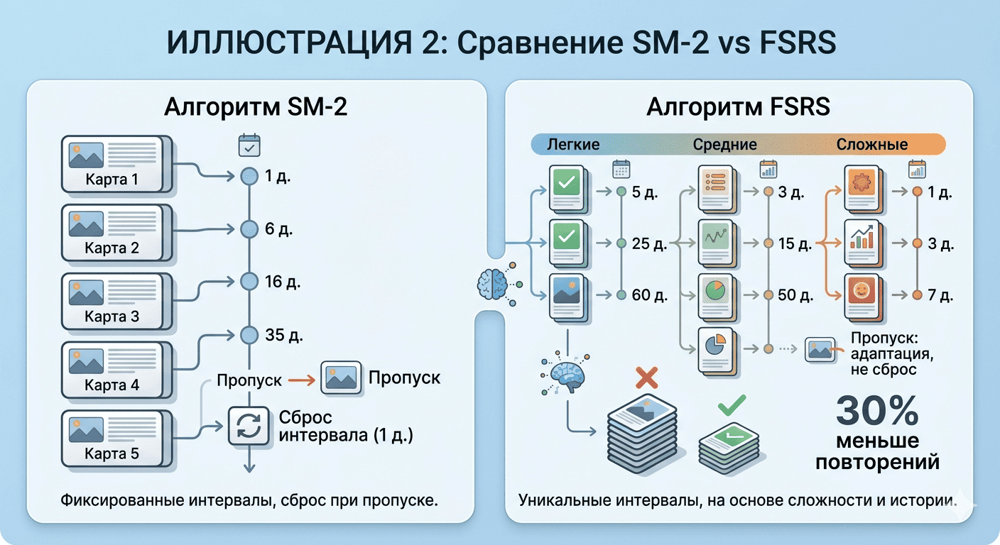
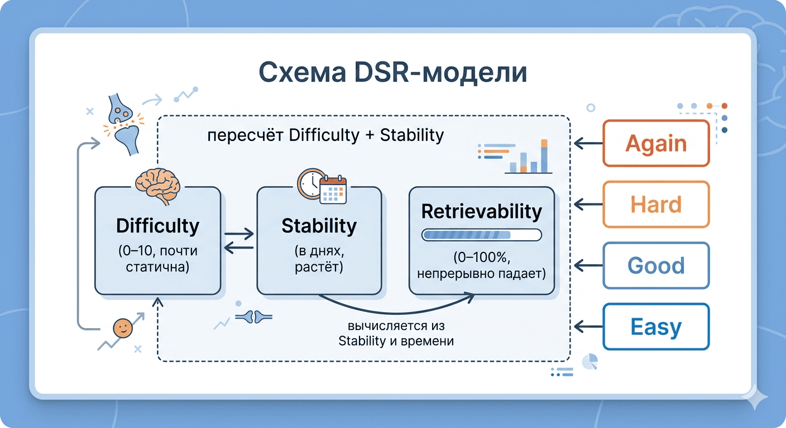

# FSRS для Obsidian: помнить всё, что важно

Обсидиан называют «вторым мозгом». Чтобы он им стал, одних связей недостаточно — нужна **память**.

Я сделал плагин интервального повторения на современном алгоритме **FSRS**. Он запоминает что и когда вы учили, предсказывает что вы вот-вот забудете, и показывает какая тема даётся тяжелее всего. Все данные — в ваших `.md` файлах, никаких внешних сервисов.


<!-- ИЛЛЮСТРАЦИЯ 1: Зацикленная анимация полного цикла повторения. Слева — отрендеренная fsrs-table с колонками (файл, извлекаемость, стабильность, сложность, следующее повторение). Курсор наводится на имя файла — справа появляется hover-окно с содержимым карточки и кнопками Again/Hard/Good/Easy. Курсор уходит внутрь окна, нажимает Good. Окно исчезает, строка таблицы обновляется: извлекаемость выросла, дата сдвинулась. Курсор переходит на следующую строку — повтор. -->

---

## Зачем ещё один плагин для повторений?

В Obsidian уже есть плагины для интервальных повторений. Все они используют **SM-2** — алгоритм 1987 года, придуманный для бумажных карточек.

Проблемы SM-2 на практике:

- **Одинаковые интервалы** для простого и сложного материала — вы повторяете и то что знаете, и то что не знаете, с одной частотой
- **Сброс прогресса** после пропуска — не повторяли неделю? Всё начинается заново
- **Нет предсказания забывания** — плагин не скажет что вы вот-вот забудете

FSRS решает эти проблемы. При том же уровне запоминания он требует **примерно на 30% меньше повторений**.


<!-- ИЛЛЮСТРАЦИЯ 2: Сравнение SM-2 vs FSRS. Две колонки с временными шкалами. SM-2: одинаковые интервалы (1, 3, 7, 14 дней), при пропуске (красный крестик) — сброс к началу. FSRS: интервалы разные — для сложной карточки короче, для лёгкой длиннее. Выделена цифра «−30% повторений». -->

---

## Как FSRS понимает вашу память

FSRS отслеживает три параметра для каждой карточки:

| Параметр | Что значит | Как меняется |
|---|---|---|
| **Сложность** (Difficulty) | Насколько труден материал | Почти не меняется — сложная тема остаётся сложной |
| **Стабильность** (Stability) | Насколько прочно запоминание, в днях | Растёт с каждым успешным повторением |
| **Извлекаемость** (Retrievability) | Вероятность вспомнить прямо сейчас | Падает каждую секунду после повторения |

После каждого ответа (**Again / Hard / Good / Easy**) алгоритм пересчитывает сложность и стабильность. Извлекаемость падает сама — и когда она опускается до порогового уровня, карточка появляется в списке на повторение.

Порог настраивается: хотите помнить 90% материала — повторений будет больше. Достаточно 80% — повторений меньше.


<!-- ИЛЛЮСТРАЦИЯ 3: Схема DSR-модели. Три блока: Difficulty (0–10, почти статична), Stability (в днях, растёт), Retrievability (0–100%, непрерывно падает). Стрелка от Stability к Retrievability с подписью «падает со временем». Четыре кнопки (Again красная, Hard оранжевая, Good зелёная, Easy синяя) ведут к пересчёту Difficulty и Stability. -->

---

## Как это выглядит в Obsidian

Ничего кроме Obsidian не нужно. Установили плагин — и работаете.

### 1. Добавьте поля FSRS в заметку

Откройте заметку, которую хотите превратить в карточку. Вызовите палитру команд (`Ctrl/Cmd+P`) и выполните:

**FSRS: ＋ Добавить поля FSRS в шапку файла**

В frontmatter появится массив `reviews` — сюда плагин будет записывать историю повторений.


<!-- ИЛЛЮСТРАЦИЯ 4: Добавление полей FSRS через командную палитру. Пользователь нажимает Ctrl+P, печатает «FSRS», выбирает команду «FSRS: ＋ Добавить поля FSRS в шапку файла». Frontmatter заметки обновляется — появляется строка `reviews: []`. -->

После выполнения команды во frontmatter заметки добавится поле `reviews` так:

```yaml
---
reviews: []
---
```

Плагин будет записывать в него даты и оценки повторений. Этих двух параметров, и истории, достаточно для рассчетов. 
После пары повторений frontmatter станет выглядеть примерно так:

```yaml
---
reviews:
  - date: "2025-03-15T12:00:00Z"
    rating: 2
  - date: "2025-03-17T08:00:00Z"
    rating: 3
---
```

Оценка `rating` — число: 0 = Again, 1 = Hard, 2 = Good, 3 = Easy.

### 2. Вставьте кнопку повторения

Та же палитра команд → **FSRS: □ Вставить блок кнопки повторения**. В текст заметки добавится code-блок, который сразу отрендерится в кнопку:

````markdown
```fsrs-review-button
```
````

В режиме просмотра он превратится в кнопку с четырьмя вариантами оценки: **Again**, **Hard**, **Good**, **Easy**. Никакого переключения в режим редактирования.


<!-- ИЛЛЮСТРАЦИЯ 5: Вставка кнопки повторения. Часть 1: Ctrl+P → команда «FSRS: □ Вставить блок кнопки повторения» → в текст вставляется code-блок fsrs-review-button. Часть 2: переключение в режим просмотра (Ctrl+E) — code-блок заменяется на четыре кнопки: Again (красная), Hard (оранжевая), Good (зелёная), Easy (синяя). -->

### 3. Создайте обзорную таблицу

В отдельной заметке (например, ежедневной) вызовите палитру команд и выполните **FSRS: ⬒ Вставить таблицу fsrs-table по умолчанию**. Команда вставит готовый блок с SQL-подобным запросом:

````markdown
```fsrs-table
SELECT file as " ", difficulty as "D",
       stability as "S", retrievability as "R",
       date_format(due, '%d.%m.%Y') as "Следующее"
LIMIT 20
```
````

В режиме просмотра блок станет таблицей со всеми вашими карточками, отсортированными по срочности — самые забытые сверху.


<!-- ИЛЛЮСТРАЦИЯ 6: Отрендеренная fsrs-table. В режиме редактирования — code-блок с SQL-запросом (SELECT file, difficulty, stability, retrievability, date_format(due) LIMIT 20). Переключение в режим просмотра — блок заменяется на HTML-таблицу с колонками: file, D, S, R, Следующее. Строки — карточки из хранилища, сверху самые забытые (R по возрастанию). Таблица прокручивается. -->

### 4. Повторяйте не переходя к заметке

Это основной сценарий. Наведите курсор на имя файла в таблице — появится всплывающее окно с содержимым заметки и кнопкой повторения внутри него. Оцениваете карточку и переходите к следующей.


<!-- ИЛЛЮСТРАЦИЯ 7: Повторение из hover-окна. Курсор наводится на имя файла в таблице — появляется hover-окно с содержимым карточки и кнопками Again/Hard/Good/Easy. Курсор заходит внутрь окна, нажимает Good. Кнопки на мгновение блокируются (пересчёт), затем снова активны. Курсор уходит — окно исчезает, курсор переходит на следующую строку — новое окно. -->

Весь цикл повторения — в одном окне:

1. Открываете заметку с таблицей
2. Видите что пора повторить
3. Наводите на карточку — читаете содержимое
4. Нажимаете оценку — карточка обновляется
5. Переходите к следующей строке таблицы

---

Позже вы можете изменить запрос под себя — например, `WHERE difficulty > 6` покажет только сложные карточки. Все доступные поля и условия — в [руководстве пользователя](../intended_use.ru.md).

---

## Установка

Плагин пока не в каталоге сообщества Obsidian — устанавливается через **BRAT** (Beta Reviewers Auto-update Tester).

1. Установите [BRAT](https://github.com/TfTHacker/obsidian42-brat) из **Settings → Community plugins → Browse**
2. Откройте **Settings → BRAT → Add Beta plugin**
3. Вставьте URL репозитория: `https://github.com/Evgene-Kopylov/fsrs_plugin`
4. Включите плагин в **Settings → Community plugins**

BRAT будет автоматически отслеживать обновления.

---

## Что дальше

- [Руководство пользователя](../intended_use.ru.md) — пошаговая инструкция со всеми возможностями
- [Техническая статья](tech-article.ru.md) — архитектура, Rust/WASM, производительность
- [Репозиторий на GitLab](https://gitlab.com/Evgene-Kopylov/FSRS-plugin) — исходный код и задачи
