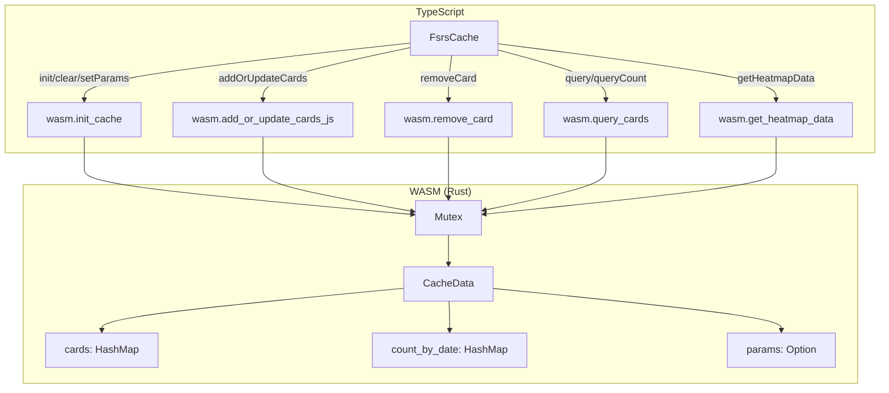
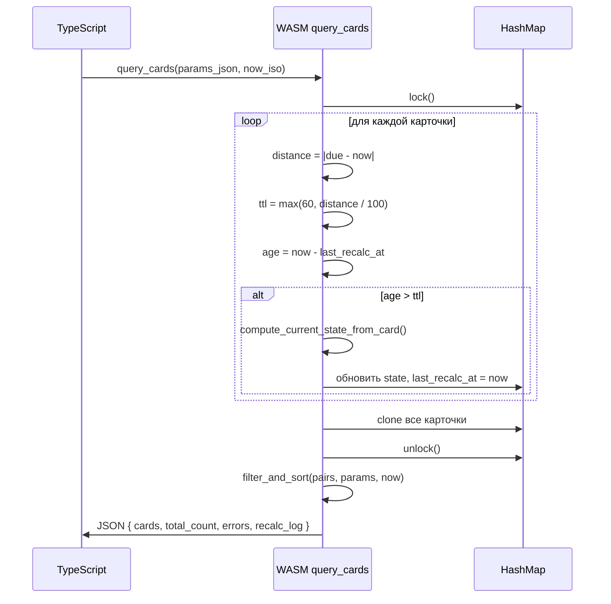

# Жизненный цикл кэша карточек

## Где живёт кэш

Кэш — глобальный `HashMap<String, CachedCard>` внутри WASM (Rust). TypeScript не хранит
карточки — только вызывает WASM-функции и парсит JSON-ответы.



**Состав записи:**

```rust
struct CachedCard {
    card: CardData,           // история повторений (reviews)
    state: ComputedState,     // due, stability, retrievability...
    last_recalc_at: DateTime, // когда состояние последний раз пересчитывали
}
```

## Этапы жизни

### 1. Инициализация

При `onLayoutReady` (Obsidian загрузил UI):

1. WASM-модуль декодируется из base64 и компилируется
2. `cache.init()` — очищает HashMap, сбрасывает параметры
3. `cache.setParams(settings)` — записывает `FsrsCacheParams`:
   - Параметры FSRS (`request_retention`, `maximum_interval`, `enable_fuzz`)
   - Дефолтные stability/difficulty
   - Константы TTL (`min_recalc_ttl_seconds = 60`, `recalc_ttl_divisor = 100`)

После этого кэш пуст и ждёт наполнения.

### 2. Наполнение (ленивое)

Сканирование запускается при первом обращении к кэшу (таблица, тепловая карта):

```
performCacheScanAsync()
  │
  ├─ getMarkdownFiles() → все .md файлы хранилища
  │
  ├─ Фильтрация: игнор-паттерны, нет frontmatter, нет поля reviews
  │
  ├─ Для каждого валидного файла:
  │   ├─ metadataCache.getFileCache(file) — без чтения файла
  │   ├─ parseReviewsFromCache(frontmatter.reviews)
  │   ├─ computeCardState(card, settings) — вызов WASM
  │   └─ batch.push({ filePath, card, state })
  │
  ├─ Каждые 500 карточек:
  │   ├─ cache.addOrUpdateCards(batch) → отправка в WASM
  │   └─ setTimeout(0) → отдать управление event loop
  │
  └─ Остаток → cache.addOrUpdateCards(batch)
```

При вставке в кэш `last_recalc_at` = `Utc::now()`.

### 3. Инкрементальные обновления (файловые события)

Подписываемся на события Obsidian Vault **после завершения начального сканирования**:

| Событие | Действие | Дебаунс |
|---|---|---|
| `modify` | `scheduleCardScan(path)` → `scanSingleCard()` | `Set` + `queueMicrotask`: повторный modify того же файла игнорируется |
| `delete` | `cache.removeCard(path)` | — |
| `rename` | `cache.removeCard(oldPath)` + `scheduleCardScan(newPath)` | — |

`scanSingleCard()`:
1. Читает файл → парсит frontmatter → `computeCardState()`
2. Если есть FSRS-данные → `addOrUpdateCards([{ path, card, state }])`
3. Если нет → `removeCard(path)`
4. Вызывает `notifyFsrsTableRenderers()` — триггерит перерисовку таблиц

### 4. Запросы (таблицы, автообновление)

Таблица вызывает `cache.query(params, now)`:



**TTL-формула:**

```
distance = |due - now|          (секунды)
ttl = max(60, distance / 100)   (секунды)

Примеры:
  due через 1 час   → ttl = 60 с     (ограничение минимумом)
  due через 1 день  → ttl = 864 с    (~14 мин)
  due через 30 дней → ttl = 25 920 с (~7.2 ч)
```

**Смысл:** чем дальше карточка от due, тем реже её нужно пересчитывать.
Близкие пересчитываются при каждом запросе, дальние — почти никогда.

### 5. Автообновление таблицы

Пока таблица видна в DOM, каждые `TABLE_AUTO_REFRESH_INTERVAL_SECONDS` (100 с):

```
setInterval → refreshValues() → cache.query(params, now) → перерендер
```

Благодаря TTL даже без изменения файлов значения `retrievability`, `elapsed_days`
обновляются со временем.

### 6. Изменение настроек

При сохранении настроек (`saveSettings`):

```
cache.setParams(newSettings)
```

Обновляет `FsrsCacheParams` в WASM. Следующий `query_cards` будет использовать
новые параметры FSRS и константы TTL.

### 7. Выгрузка плагина

Кэш не сохраняется — при `onunload` WASM-память освобождается.
При следующей загрузке плагин заново сканирует хранилище.

---

## Роли Rust и TypeScript

| | Rust (WASM) | TypeScript |
|---|---|---|
| Хранение | `HashMap` + `Mutex` | — |
| Наполнение | `add_or_update_cards_js()` | Чтение файлов, парсинг frontmatter |
| Пересчёт | TTL-логика, `compute_current_state_from_card()` | — |
| Фильтрация/сортировка | `filter_and_sort_cards_with_states()` | — |
| Инвалидация | `remove_card()` по команде TS | Файловые события → вызов remove/add |
| Параметры | `FsrsCacheParams` в `CacheData` | `cache.setParams()` при init + saveSettings |
| Рендеринг | — | `query()` → JSON → DOM |
