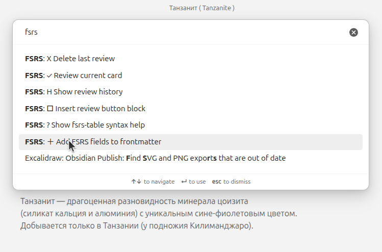
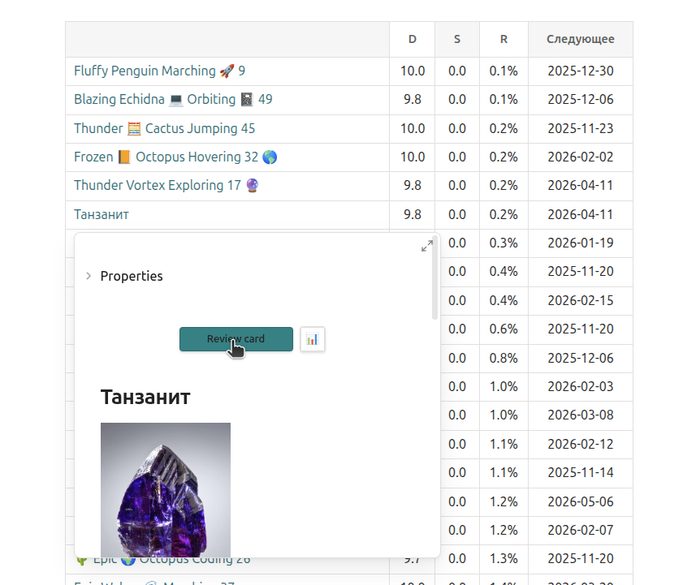
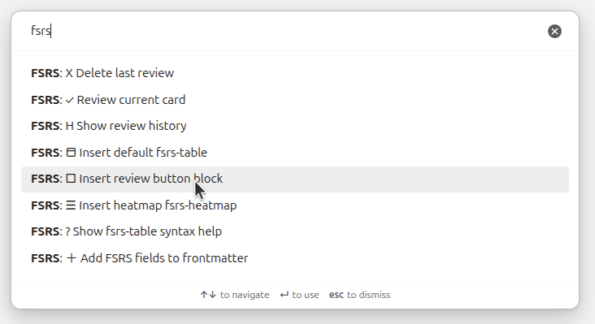
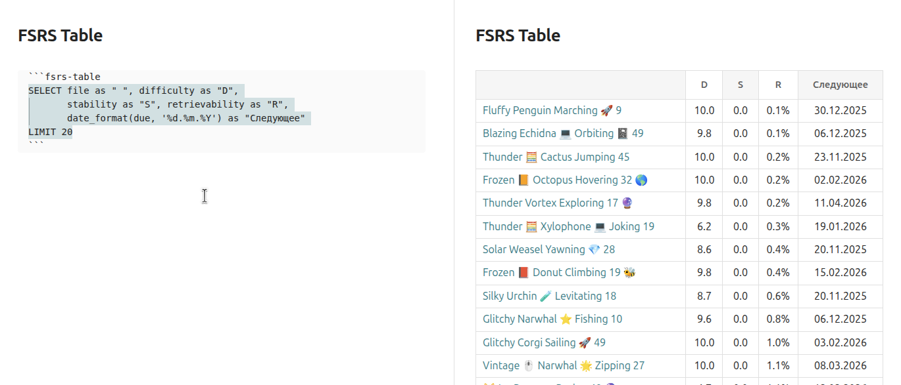
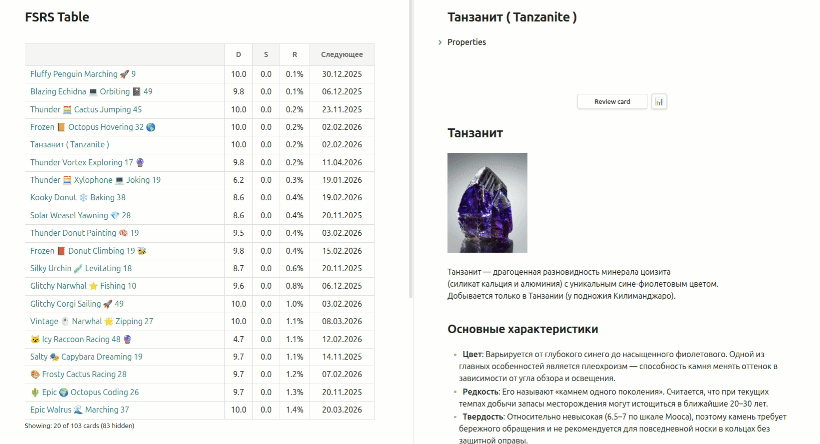

# FSRS Usage Guide

- [🇷🇺](intended_use.ru.md)
- [🇺🇸](intended_use.en.md) <
- [🇨🇳](intended_use.zh.md)

This guide shows how to start using the plugin after installation.
Everything works inside Obsidian — no external services needed.

---

## 0. Installation

The plugin is not yet in the Obsidian community catalog —
install it via **BRAT** (Beta Reviewers Auto-update Tester):

1. Install [BRAT](https://github.com/TfTHacker/obsidian42-brat)
   from **Settings → Community plugins → Browse**
2. Open **Settings → BRAT → Add Beta plugin**
3. Enter the repo URL: `https://github.com/Evgene-Kopylov/fsrs_plugin`
4. Enable the plugin in **Settings → Community plugins**

BRAT will automatically track updates.

---

## 1. Initialize a card

After installing and enabling the plugin, open the note you plan to review.

Open the command palette (`Ctrl/Cmd+P`) and run:

### FSRS: Add FSRS fields to frontmatter



The plugin adds an empty `reviews: []` array to the note's frontmatter
and inserts a review button right after the frontmatter:

````markdown
---
reviews: []
---

```fsrs-review-button
```
````

In reading mode the code block renders as a button.
Clicking it opens a popup with rating options:
**Again**, **Hard**, **Good**, **Easy**.



The button is clickable in the hover preview from the table —
this is the main review workflow (see section 2).

You can also review via command **FSRS: ✓ Review current card** —
no button needed, straight from the palette. Whether to auto-insert
the button can be configured in settings.

The `reviews` array stores dates and ratings.
After a couple of reviews, the frontmatter looks like this:

```yaml
---
reviews:
  - date: "2025-03-15T12:00:00Z"
    rating: 2
  - date: "2025-03-17T08:00:00Z"
    rating: 3
---
```

Rating values:
**0** = Again,
**1** = Hard,
**2** = Good,
**3** = Easy.

If auto-insert is disabled in settings —
add the button manually via **FSRS: Insert review button**.

---

## 2. Create a card table

Open a note where you want to see a list of your cards
and run:

### FSRS: Insert default fsrs-table



It inserts a ready-to-use `fsrs-table` block with an SQL-like query:

````markdown
```fsrs-table
SELECT file as "Card",
       r as "R",
       s as "S",
       d as "D",
       due as "Due"
LIMIT 20
```
````

In reading mode the block renders as a table with all your cards,
sorted by default (by urgency — most forgotten first).



### Column reference

FSRS computes three parameters for each card
based on review history (date and rating):

| Field | Meaning | How it changes |
| --- | --- | --- |
| **Difficulty** (D) | How hard the material is | Stays nearly constant — a hard topic stays hard |
| **Stability** (S) | How firmly the memory is held, in days | Grows with each successful review |
| **Retrievability** (R) | Probability of recall right now | Falls every second after review |

When Retrievability drops below the threshold, the card appears in the review list.
The threshold is configurable: want 90% retention? Review more often. 80% is enough? Fewer reviews.

Full list of available columns — see [README](README.md#available-columns).
Query customization examples — see [sql-syntax.md](sql-syntax.md).

---

## 3. Review without navigating

This is the main plugin workflow.
Hover over a file name in the table.

A popover appears showing the note's content,
with the review button inside — clickable directly from the preview.



The review cycle stays in one window:

1. Open a note with the table (e.g., your daily note).
2. The table shows all cards — most urgent first.
3. Hover over a card — the content pops up.
4. Read, click a rating — the card updates.
5. Move to the next row.

This way you can go through all cards in minutes
without ever switching to another note.

---

## Quick-start checklist

- [ ] Plugin installed via BRAT and enabled
- [ ] Run **FSRS: Add FSRS fields to frontmatter**
  on your first card note (the button is added automatically)
- [ ] Run **FSRS: Insert default fsrs-table**
- [ ] Ready to review

---
