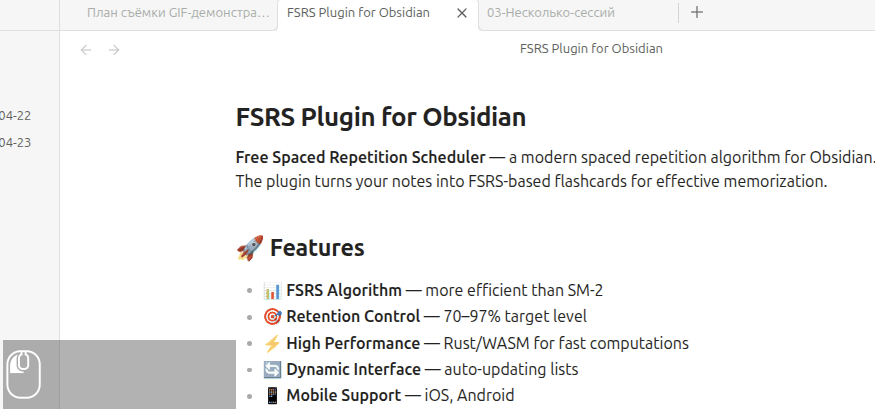
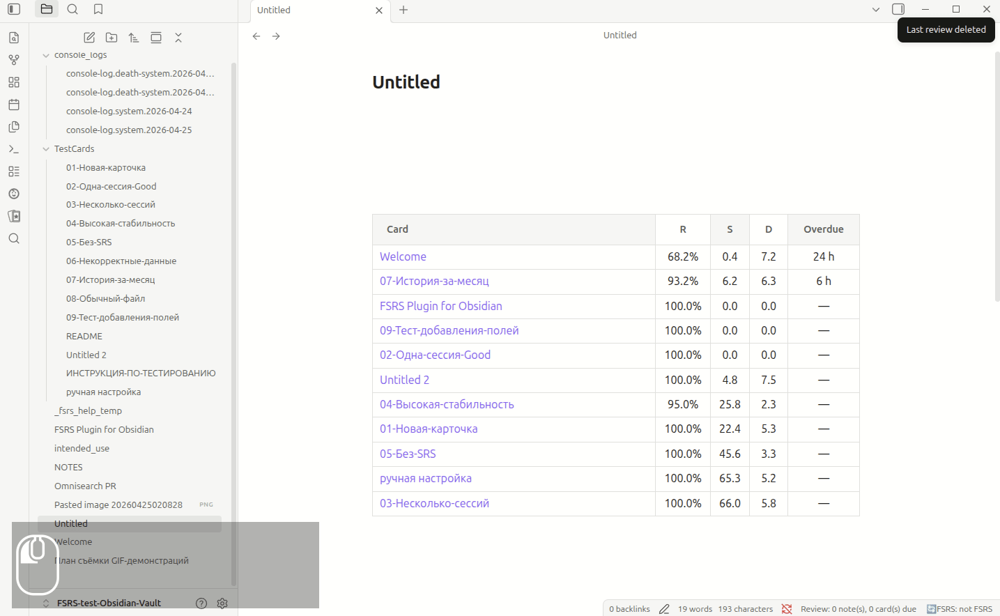

# FSRS Usage Guide

- [🇷🇺](intended_use.ru.md)
- [🇺🇸](intended_use.md) <

This guide shows how to start using the plugin after installation.
Everything works inside Obsidian — no external services needed.

---

## 1. Add FSRS fields to a note

After installing and enabling the plugin, open any note.

Open the command palette (`Ctrl/Cmd+P`) and run:

**FSRS: Add FSRS fields to frontmatter**

The plugin adds an empty `reviews: []` array to the note's frontmatter.
From now on, the note is considered an FSRS card — ready for review.



After adding the fields, the frontmatter looks like this:

```yaml
---
reviews: []
---
```

---

## 2. Insert the review button

The review button lets you rate a card (Again / Hard / Good / Easy)
directly in reading mode — no need to switch to editing.

Open the command palette (`Ctrl/Cmd+P`) and run:

**FSRS: Insert review button**

The button is inserted as a code block in the note:

````markdown
```fsrs-review-button
```
````

In reading mode (`Ctrl/Cmd+E`) the block renders as a button
with four rating options.


---

## 3. Create the card table

Open a note where you want to see a list of your cards
and insert an `fsrs-table` block with an SQL-like query
(or use the `Insert default fsrs-table` command):

````markdown
```fsrs-table
SELECT file as "Card",
       retrievability as "R",
       stability as "S",
       difficulty as "D",
       overdue as "Overdue"
LIMIT 20
```
````

In reading mode the block renders as a table with all your cards,
sorted by default (most overdue first). If you have no overdue cards, that column is empty.


### Column reference

Full list of available columns in the [README](README.md#available-columns).

---

## 4. Review without navigating

Hover over a file name in the table.

A popover appears showing the note's content,
with the review button inside — clickable directly from the preview.



This lets you:

- **Preview** the card content — without opening the note.
- **Rate** the card (Again / Hard / Good / Easy) —
  right from the popover.
- **Go through** all overdue cards in minutes —
  opening them one by one from the table.

The main usage workflow:

1. Open a note with the table (e.g., your daily note).
2. The table shows all cards and their status.
3. Hover over an overdue card — the content pops up.
4. Click a rating — the card updates.
5. Move on to the next one.

---

## Quick-start checklist

- [ ] Plugin installed and enabled
- [ ] Run **Add FSRS fields to frontmatter**
  on your first card note
- [ ] Insert `fsrs-review-button`
  in the same note
- [ ] Create a note with `fsrs-table` to view all cards
- [ ] Ready to review

---
