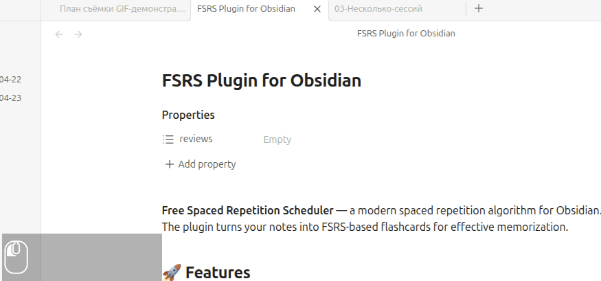
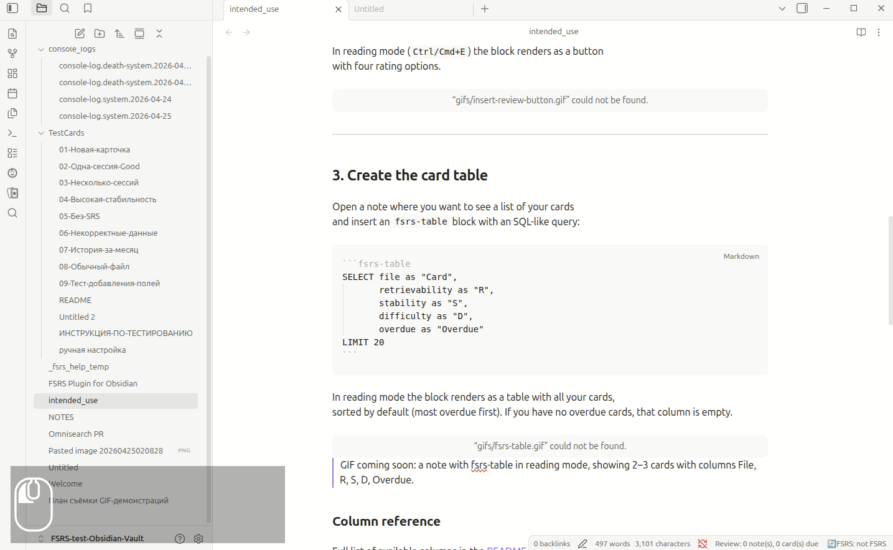

# FSRS 使用指南

- [🇷🇺](intended_use.ru.md)
- [🇺🇸](intended_use.md)
- [🇨🇳](intended_use.zh.md) <

本指南将介绍安装插件后如何开始使用。
一切都在 Obsidian 中运行 — 无需外部服务。

---

## 1. 向笔记添加 FSRS 字段

安装并启用插件后，打开任意笔记。

打开命令面板（`Ctrl/Cmd+P`）并执行：

**FSRS：添加 FSRS 字段到 frontmatter**

插件将在笔记的 frontmatter 中添加一个空的 `reviews: []` 数组。
从此，该笔记被视为 FSRS 卡片 — 可以开始复习了。


添加字段后，笔记的 frontmatter 如下所示：

```yaml
---
reviews: []
---
```

---

## 2. 添加复习按钮

复习按钮允许您在阅读模式下直接对卡片进行评分（重来 / 困难 / 良好 / 简单）
— 无需切换到编辑模式。

再次打开命令面板（`Ctrl/Cmd+P`）并执行：

**FSRS：插入复习按钮块**

按钮以代码块形式插入到笔记正文中：

````markdown
```fsrs-review-button
```
````

在阅读模式（`Ctrl/Cmd+E`）下，该块将渲染为带有四个评分选项的按钮。



---

## 3. 创建卡片表格

现在打开您想要查看卡片集合的笔记，
并插入带有类 SQL 查询的 `fsrs-table` 块
（或使用命令 `插入默认 fsrs-table`）：

````markdown
```fsrs-table
SELECT file as "卡片",
       retrievability as "R",
       stability as "S",
       difficulty as "D",
       due as "下次复习"
LIMIT 20
```
````

在阅读模式下，该块将渲染为包含所有卡片的表格，
默认排序（按逾期 — 最逾期的在最上面）。您没有逾期的卡片，因此该字段为空。



### 各列含义

完整字段列表 — 见 [README](../README.zh.md###可用字段列)。

---

## 4. 无需跳转到笔记即可复习

将鼠标悬停在表格中的文件名上。

将弹出一个包含笔记内容的弹出窗口，
里面正是那个复习按钮 — 可以直接从预览中点击。


这样您可以：

- **预览**卡片内容 — 无需跳转到笔记。
- **评分**卡片（重来 / 困难 / 良好 / 简单）—
  直接从弹出窗口进行。
- **在几分钟内浏览**所有逾期卡片 —
  通过表格逐个打开。

这是插件的主要使用场景：

1. 打开包含表格的笔记（例如每日笔记）。
2. 表格显示所有卡片及其状态。
3. 悬停在逾期卡片上 — 弹出内容。
4. 点击评分 — 卡片更新。
5. 继续下一张。

---

## 首次使用快速检查清单

- [ ] 已安装插件
- [ ] 已对第一张笔记执行「添加 FSRS 字段到 frontmatter」命令
- [ ] 已在该笔记中插入 `fsrs-review-button` 复习按钮
- [ ] 已创建包含 `fsrs-table` 块的笔记以概览所有卡片
- [ ] 一切就绪，可以开始复习

---
